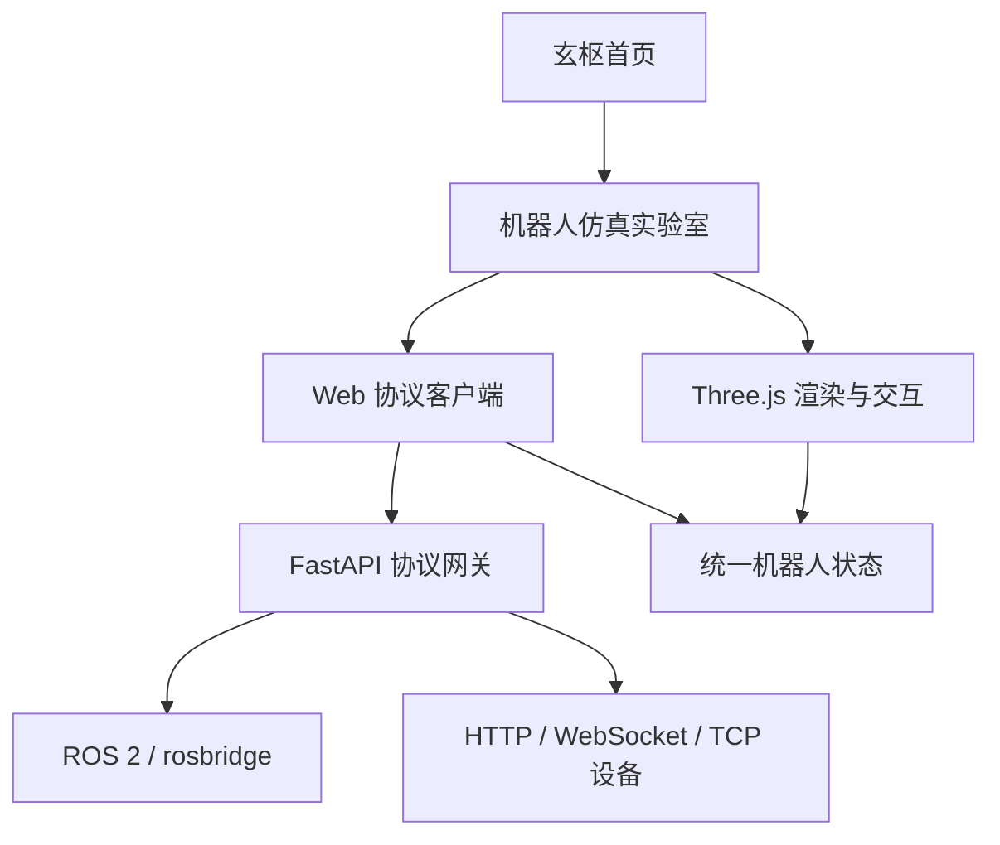
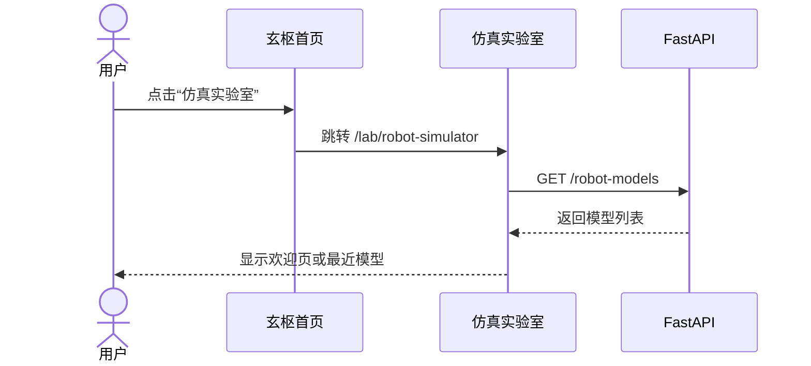
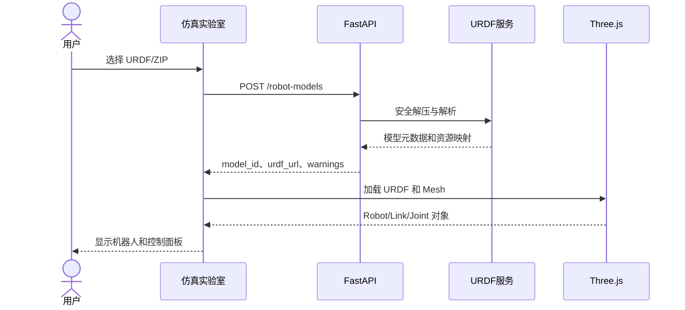
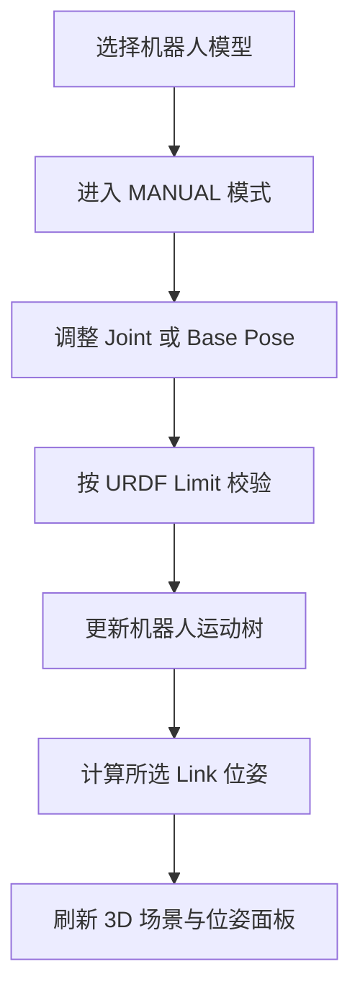
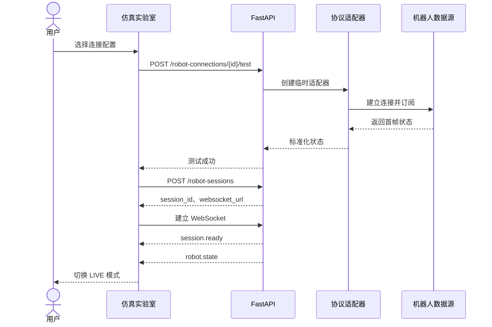
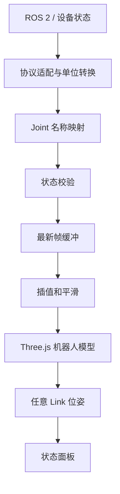
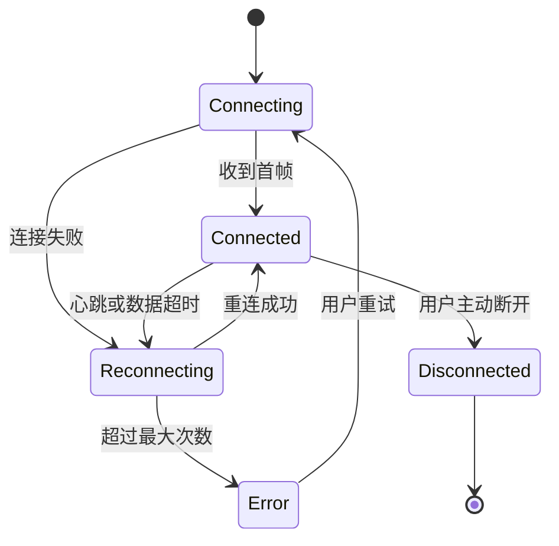
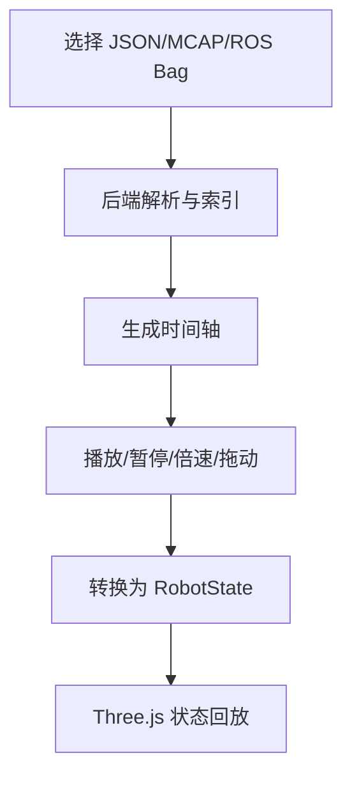
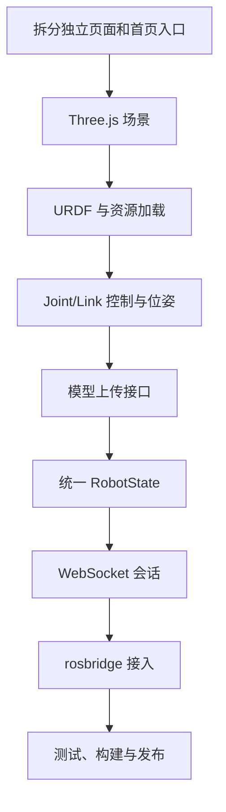

# 玄枢·机器人仿真实验室技术设计文档

> 项目：`iSeeker-Junfeng/robot-learning-hub`  
> 目标分支：`develop`  
> 文档版本：V1.0  
> 日期：2026-07-30  
> 状态：方案评审稿

## 1. 文档目的

本文档用于指导“玄枢”机器人学习平台新增“机器人仿真实验室”模块的设计与开发。

机器人仿真实验室面向通用 URDF 机器人，不限定机械臂类型。用户只要提供符合约定的 URDF 资源包，即可在 Web 页面中加载机器人、查看 Link/Joint 结构、手动调整关节、查看任意坐标系位姿，并通过可配置协议接入真实机器人状态。

第一阶段重点实现可视化和真实状态跟随，不在浏览器中直接向真实机器人下发运动控制命令。

## 2. 建设目标

### 2.1 功能目标

1. 在首页增加“机器人仿真实验室”入口。
2. 新增独立页面 `/lab/robot-simulator`。
3. 支持上传和加载 URDF 机器人资源包。
4. 自动解析 Robot、Link、Joint、Visual、Collision 和 Joint Limit。
5. 使用 Three.js 渲染机器人模型。
6. 根据 Joint 类型自动生成控制组件。
7. 支持选择任意 Link 并查看其世界位姿或相对位姿。
8. 支持手动仿真、数据回放和真实机器人跟随三种运行模式。
9. 支持 ROS 2 rosbridge、通用 WebSocket JSON 和 HTTP 轮询协议。
10. 为厂商 TCP、串口、CAN/CAN FD 协议预留后端适配器。

### 2.2 非功能目标

- 3D 场景与通信协议解耦。
- 不硬编码机器人类型、关节数量、根 Link 或末端 Link。
- 30 Hz 状态输入下保持页面平滑。
- 协议断开后不影响模型手动操作。
- 上传资源经过大小、格式和路径安全校验。
- 配置中不保存明文设备密码或敏感令牌。
- 后续能够扩展 IK、碰撞检测、轨迹规划、MCAP 回放和多机器人场景。

### 2.3 第一阶段不包含

- 高保真动力学仿真。
- 刚体碰撞求解。
- 力矩、摩擦、惯量的物理计算。
- 浏览器直接访问 TCP、串口、CAN 或 CAN FD。
- 从 Web 页面向真实机器人发送运动命令。
- 完整 Xacro 宏解释器。
- MoveIt 2 规划和逆运动学。

Three.js 第一阶段承担运动学可视化，不替代 Gazebo、MuJoCo、Isaac Sim 等动力学仿真器。

## 3. 适用机器人范围

系统不按“机械臂、移动机器人、四足机器人”编写专用渲染代码，而是按 URDF 运动树处理机器人。

| 类型 | 示例 | 第一阶段能力 |
|---|---|---|
| 单臂/双臂机器人 | RM65、JAKA、Panda | 关节控制、任意 Link 位姿、真实状态跟随 |
| 移动机器人 | 差速底盘、AGV | 基座位姿、轮关节显示、TF 跟随 |
| 四足机器人 | Unitree 类结构 | 多关节控制、姿态显示、TF 跟随 |
| 人形机器人 | 双腿、双臂、躯干 | 多关节层级、基座姿态、任意 Link 位姿 |
| 无人机 | 多旋翼、云台 | 基座六自由度、旋翼或云台关节显示 |
| 灵巧手/夹爪 | 多指手、平行夹爪 | 多关节控制、联动关节扩展 |
| 自定义机构 | 教学模型、实验机构 | 按 URDF Joint Tree 加载 |

URDF 应当构成单根运动树。多机器人场景在后续版本中通过多个 URDF 实例实现。

## 4. 现有项目集成

当前仓库采用 React 19、Next.js/Vinext 和 FastAPI，后端默认端口为 `8888`。机器人仿真实验室作为现有平台的一部分接入。

### 4.1 页面入口

首页增加两个入口：

1. 顶部导航增加“仿真实验室”。
2. 首页增加“进入机器人仿真实验室”功能入口。

跳转地址：

```text
/lab/robot-simulator
```

### 4.2 前端目录

```text
frontend/app/
├── page.jsx
├── lab/
│   └── robot-simulator/
│       └── page.jsx
├── components/
│   └── robot-simulator/
│       ├── RobotSimulator.jsx
│       ├── RobotViewport.jsx
│       ├── RobotTree.jsx
│       ├── UrdfUploader.jsx
│       ├── JointControlPanel.jsx
│       ├── BasePosePanel.jsx
│       ├── FramePosePanel.jsx
│       ├── ConnectionPanel.jsx
│       ├── SimulatorToolbar.jsx
│       └── SimulatorStatusBar.jsx
└── lib/
    └── robot-simulator/
        ├── api-client.js
        ├── urdf-assets.js
        ├── robot-state.js
        ├── frame-transform.js
        ├── state-buffer.js
        └── adapters/
            ├── base-adapter.js
            ├── manual-adapter.js
            ├── rosbridge-adapter.js
            ├── websocket-adapter.js
            └── http-polling-adapter.js
```

### 4.3 后端目录

```text
backend/app/
├── main.py
├── schemas.py
├── storage.py
├── routers/
│   ├── robot_models.py
│   └── robot_connections.py
├── robot_models/
│   ├── archive.py
│   ├── parser.py
│   └── service.py
└── robot_protocols/
    ├── base.py
    ├── manager.py
    ├── rosbridge.py
    ├── websocket_adapter.py
    ├── http_adapter.py
    └── tcp_adapter.py
```

### 4.4 依赖调整

前端增加：

```bash
cd frontend
npm install three urdf-loader roslib
```

开发时根据 Three.js、URDFLoader、roslib 与 Vinext 的实际兼容性锁定具体版本，并提交 `package-lock.json`。

后端上传 `multipart/form-data` 文件需要增加：

```toml
dependencies = [
  # 保留现有依赖
  "python-multipart>=0.0.20,<1",
]
```

## 5. 总体架构



### 5.1 分层职责

| 层级 | 职责 |
|---|---|
| 页面层 | 页面布局、上传、连接配置、模式切换、状态提示 |
| 3D 渲染层 | Three.js 场景、相机、灯光、网格、机器人模型 |
| URDF 模型层 | URDF 解析、Mesh 路径解析、Joint/Link 元数据 |
| 状态层 | 合并手动状态、实时状态和回放状态 |
| 协议客户端层 | 浏览器可直接访问的 rosbridge、WebSocket、HTTP |
| FastAPI 网关层 | 文件管理、配置管理、设备协议代理、WebSocket 会话 |
| 设备适配层 | ROS 2、厂商 TCP、HTTP、WebSocket 等协议转换 |
| SQLite 层 | 模型元数据、连接配置和后续回放任务信息 |

### 5.2 核心设计原则

1. 3D 渲染只消费统一 `RobotState`，不感知数据来自 ROS 2 还是厂商 TCP。
2. 协议适配器只产生统一状态，不直接操作 Three.js 对象。
3. URDF 是机器人结构和运动约束的来源。
4. 真实数据是当前状态的来源。
5. 所有外部关节名称通过映射表转换为 URDF Joint 名称。
6. 所有角度进入前端状态层后统一使用弧度。
7. 所有长度进入前端状态层后统一使用米。

## 6. 页面设计

### 6.1 页面布局

```text
┌─────────────────────────────────────────────────────────────────────┐
│ 返回玄枢  机器人仿真实验室  模型  模式  连接  复位  全屏           │
├───────────────┬──────────────────────────────────┬──────────────────┤
│ Robot Tree    │                                  │ Joint Control    │
│               │          Three.js 场景           │                  │
│ Links         │                                  │ Base Pose        │
│ Joints        │                                  │                  │
│ Frames        │                                  │ Frame Pose       │
├───────────────┴──────────────────────────────────┴──────────────────┤
│ 连接状态 | 数据频率 | 延迟 | 最新时间 | 模式 | 错误信息             │
└─────────────────────────────────────────────────────────────────────┘
```

### 6.2 页面运行模式

```text
MANUAL    手动仿真
LIVE      真实机器人跟随
PLAYBACK  数据回放
```

模式切换规则：

- `MANUAL → LIVE`：连接成功并收到首帧有效状态后切换。
- `LIVE → MANUAL`：用户主动断开或连接失败时切换。
- `PLAYBACK → LIVE`：必须先停止回放，再建立实时连接。
- `LIVE` 模式下默认禁止关节滑块修改真实状态。

### 6.3 Joint 控件生成规则

| URDF Joint 类型 | 页面控件 |
|---|---|
| fixed | 只展示，不生成控制器 |
| revolute | 带上下限的角度滑块 |
| continuous | 循环角度滑块或数值输入 |
| prismatic | 带上下限的位移滑块 |
| planar | 基座 X、Y、Yaw 控件 |
| floating | 基座 X、Y、Z、Roll、Pitch、Yaw 控件 |

Mimic Joint 第一阶段只展示关联关系，后续增加主从关节联动计算。

## 7. URDF 资源规范

### 7.1 上传格式

推荐上传 ZIP：

```text
robot-model.zip
├── robot.urdf
├── meshes/
│   ├── base_link.stl
│   ├── link_1.dae
│   └── sensor.obj
└── textures/
    └── body.png
```

也支持仅上传不依赖外部 Mesh 的单个 `.urdf` 文件。

### 7.2 Mesh 路径处理

支持：

```text
meshes/base.stl
./meshes/base.stl
package://robot_description/meshes/base.stl
```

对于 `package://`：

1. 去掉 `package://`。
2. 识别包名。
3. 优先匹配 ZIP 内同名目录。
4. 如果 ZIP 没有包名目录，则尝试从 `meshes/` 开始匹配。
5. 无法匹配时显示缺失资源清单，但保留运动树。

### 7.3 安全限制

建议默认限制：

| 项目 | 默认值 |
|---|---:|
| ZIP 大小 | 50 MB |
| 解压后总大小 | 200 MB |
| 文件数量 | 2000 |
| 单个 Mesh | 50 MB |
| URDF 文件数量 | 10 |
| URDF XML 深度 | 128 |

必须拒绝：

- `../` 路径穿越。
- 绝对路径写入。
- 符号链接。
- 可执行脚本。
- ZIP 炸弹。
- 外部实体和 XML 实体展开。
- 不在白名单内的文件类型。

### 7.4 模型解析结果

```json
{
  "model_id": "mdl_01JXYZ",
  "name": "demo_robot",
  "urdf_file": "robot.urdf",
  "root_link": "base_link",
  "links": [
    {
      "name": "base_link",
      "visual_count": 1,
      "collision_count": 1
    }
  ],
  "joints": [
    {
      "name": "joint_1",
      "type": "revolute",
      "parent": "base_link",
      "child": "link_1",
      "axis": [0, 0, 1],
      "limit": {
        "lower": -3.14,
        "upper": 3.14,
        "velocity": 1.5,
        "effort": 20
      }
    }
  ],
  "missing_assets": [],
  "warnings": []
}
```

## 8. 统一数据模型

### 8.1 RobotState

```json
{
  "schema_version": "1.0",
  "robot_id": "robot_001",
  "sequence": 1024,
  "timestamp": 1785384000.123,
  "source": "rosbridge",
  "connection": "connected",
  "base_pose": {
    "frame_id": "world",
    "child_frame_id": "base_link",
    "position": {
      "x": 1.2,
      "y": 0.4,
      "z": 0.0
    },
    "quaternion": {
      "x": 0.0,
      "y": 0.0,
      "z": 0.382683,
      "w": 0.92388
    }
  },
  "joints": {
    "left_wheel_joint": {
      "position": 2.4,
      "velocity": 0.8,
      "effort": 0.0
    },
    "arm_joint_1": {
      "position": 0.52,
      "velocity": 0.1,
      "effort": 1.3
    }
  },
  "transforms": {
    "camera_link": {
      "parent": "base_link",
      "position": {
        "x": 0.2,
        "y": 0.0,
        "z": 0.8
      },
      "quaternion": {
        "x": 0.0,
        "y": 0.0,
        "z": 0.0,
        "w": 1.0
      }
    }
  },
  "diagnostics": {
    "latency_ms": 18.2,
    "frequency_hz": 29.8,
    "dropped_frames": 0
  }
}
```

### 8.2 单位约定

| 数据 | 统一单位 |
|---|---|
| 转动关节位置 | rad |
| 转动关节速度 | rad/s |
| 移动关节位置 | m |
| 移动关节速度 | m/s |
| 力矩 | N·m |
| 力 | N |
| 时间戳 | Unix Seconds，允许小数 |
| 四元数顺序 | x、y、z、w |

### 8.3 Joint 映射

外部设备名称可能与 URDF 不一致，通过连接配置进行映射：

```json
{
  "joint_mapping": {
    "joint_1": "shoulder_pan_joint",
    "joint_2": "shoulder_lift_joint"
  }
}
```

约定为：

```text
外部数据关节名 -> URDF Joint 名
```

没有配置映射时使用同名匹配。无法匹配的关节记录为警告，不中断整帧状态。

## 9. 数据库设计

现有 SQLite 增加以下表。

### 9.1 robot_models

```sql
CREATE TABLE IF NOT EXISTS robot_models (
    id TEXT PRIMARY KEY,
    name TEXT NOT NULL,
    description TEXT NOT NULL DEFAULT '',
    urdf_file TEXT NOT NULL,
    storage_path TEXT NOT NULL,
    root_link TEXT NOT NULL,
    metadata_json TEXT NOT NULL,
    created_at TEXT NOT NULL,
    updated_at TEXT NOT NULL
);
```

### 9.2 robot_connections

```sql
CREATE TABLE IF NOT EXISTS robot_connections (
    id TEXT PRIMARY KEY,
    name TEXT NOT NULL,
    adapter TEXT NOT NULL,
    endpoint TEXT NOT NULL,
    config_json TEXT NOT NULL,
    enabled INTEGER NOT NULL DEFAULT 1,
    created_at TEXT NOT NULL,
    updated_at TEXT NOT NULL
);
```

### 9.3 robot_playbacks

第二阶段增加：

```sql
CREATE TABLE IF NOT EXISTS robot_playbacks (
    id TEXT PRIMARY KEY,
    robot_model_id TEXT NOT NULL,
    name TEXT NOT NULL,
    file_path TEXT NOT NULL,
    format TEXT NOT NULL,
    duration_seconds REAL NOT NULL DEFAULT 0,
    metadata_json TEXT NOT NULL,
    created_at TEXT NOT NULL,
    FOREIGN KEY(robot_model_id) REFERENCES robot_models(id)
);
```

## 10. REST API 设计

统一前缀：

```text
/api/v1
```

### 10.1 模型接口

| 方法 | 地址 | 说明 |
|---|---|---|
| POST | `/robot-models` | 上传 URDF 或 ZIP |
| GET | `/robot-models` | 查询模型列表 |
| GET | `/robot-models/{model_id}` | 查询模型详情 |
| GET | `/robot-models/{model_id}/urdf` | 获取处理后的 URDF |
| GET | `/robot-models/{model_id}/assets/{path}` | 获取 Mesh/Texture |
| DELETE | `/robot-models/{model_id}` | 删除模型 |

#### 上传模型

```http
POST /api/v1/robot-models
Content-Type: multipart/form-data

file=<robot.zip>
name=RM65
description=RM65 教学模型
```

成功响应：

```json
{
  "id": "mdl_01JXYZ",
  "name": "RM65",
  "root_link": "base_link",
  "links_count": 8,
  "joints_count": 7,
  "movable_joints_count": 6,
  "urdf_url": "/api/v1/robot-models/mdl_01JXYZ/urdf",
  "warnings": []
}
```

错误码：

| HTTP | code | 说明 |
|---:|---|---|
| 400 | `invalid_archive` | 压缩包无法读取 |
| 400 | `urdf_not_found` | 没有找到 URDF |
| 400 | `invalid_urdf` | URDF XML 或运动树无效 |
| 413 | `archive_too_large` | 上传文件过大 |
| 422 | `multiple_urdf_requires_selection` | 存在多个 URDF，需要指定入口 |
| 409 | `model_name_conflict` | 模型名称冲突 |

### 10.2 连接配置接口

| 方法 | 地址 | 说明 |
|---|---|---|
| POST | `/robot-connections` | 新建连接配置 |
| GET | `/robot-connections` | 查询连接配置 |
| GET | `/robot-connections/{connection_id}` | 查询连接详情 |
| PUT | `/robot-connections/{connection_id}` | 更新连接配置 |
| DELETE | `/robot-connections/{connection_id}` | 删除连接配置 |
| POST | `/robot-connections/{connection_id}/test` | 测试连接 |
| GET | `/robot-connections/adapters` | 查询支持的适配器 |

新建连接：

```json
{
  "name": "RM65 ROS2",
  "adapter": "rosbridge",
  "endpoint": "ws://192.168.1.10:9090",
  "config": {
    "joint_topic": "/joint_states",
    "joint_message_type": "sensor_msgs/msg/JointState",
    "tf_topic": "/tf",
    "base_frame": "base_link",
    "joint_mapping": {},
    "angle_unit": "rad",
    "update_rate_hz": 30,
    "reconnect": {
      "enabled": true,
      "initial_delay_ms": 1000,
      "max_delay_ms": 30000
    }
  }
}
```

测试连接响应：

```json
{
  "ok": true,
  "latency_ms": 16.8,
  "message": "已连接并收到 /joint_states",
  "sample": {
    "joint_count": 6,
    "timestamp": 1785384000.123
  }
}
```

### 10.3 会话接口

| 方法 | 地址 | 说明 |
|---|---|---|
| POST | `/robot-sessions` | 创建实时会话 |
| GET | `/robot-sessions/{session_id}` | 查询会话状态 |
| DELETE | `/robot-sessions/{session_id}` | 停止实时会话 |

创建会话：

```json
{
  "robot_id": "robot_001",
  "model_id": "mdl_01JXYZ",
  "connection_id": "conn_01JABC",
  "mode": "live"
}
```

响应：

```json
{
  "session_id": "sess_01JDEF",
  "status": "connecting",
  "websocket_url": "/api/v1/robot-sessions/sess_01JDEF/ws"
}
```

## 11. WebSocket API 设计

地址：

```text
WS /api/v1/robot-sessions/{session_id}/ws
```

### 11.1 消息信封

所有消息使用统一结构：

```json
{
  "type": "robot.state",
  "request_id": null,
  "timestamp": 1785384000.123,
  "data": {}
}
```

### 11.2 服务端消息

| type | 说明 |
|---|---|
| `session.ready` | 会话已经建立 |
| `connection.state` | 连接状态变化 |
| `robot.metadata` | 机器人模型元数据 |
| `robot.state` | 统一机器人状态 |
| `robot.warning` | 可恢复警告 |
| `robot.error` | 错误 |
| `session.heartbeat` | 心跳 |

连接状态：

```json
{
  "type": "connection.state",
  "timestamp": 1785384000.123,
  "data": {
    "status": "connected",
    "adapter": "rosbridge",
    "endpoint": "ws://192.168.1.10:9090",
    "retry_count": 0
  }
}
```

错误消息：

```json
{
  "type": "robot.error",
  "timestamp": 1785384000.123,
  "data": {
    "code": "upstream_disconnected",
    "message": "机器人数据源连接已断开",
    "recoverable": true
  }
}
```

### 11.3 客户端消息

第一阶段只允许会话控制，不允许运动控制：

| type | 说明 |
|---|---|
| `session.subscribe` | 订阅状态 |
| `session.pause` | 暂停向当前浏览器推送 |
| `session.resume` | 恢复推送 |
| `session.ping` | 客户端心跳 |

订阅：

```json
{
  "type": "session.subscribe",
  "request_id": "req_001",
  "timestamp": 1785384000.123,
  "data": {
    "max_rate_hz": 30,
    "include_velocity": true,
    "include_effort": false,
    "include_transforms": true
  }
}
```

服务端可以按 `max_rate_hz` 降采样，但不得改变原始时间戳。

## 12. FastAPI 接口实现

以下代码用于说明接口组织和核心实现，开发时应拆分到对应模块。

### 12.1 Pydantic Schema

```python
from __future__ import annotations

from typing import Any, Literal

from pydantic import BaseModel, Field, field_validator


class Vector3(BaseModel):
    x: float = 0.0
    y: float = 0.0
    z: float = 0.0


class Quaternion(BaseModel):
    x: float = 0.0
    y: float = 0.0
    z: float = 0.0
    w: float = 1.0


class Pose(BaseModel):
    frame_id: str
    child_frame_id: str
    position: Vector3
    quaternion: Quaternion


class JointStateValue(BaseModel):
    position: float
    velocity: float | None = None
    effort: float | None = None


class RobotState(BaseModel):
    schema_version: Literal["1.0"] = "1.0"
    robot_id: str
    sequence: int = Field(ge=0)
    timestamp: float
    source: str
    connection: Literal["connecting", "connected", "reconnecting", "disconnected", "error"]
    base_pose: Pose | None = None
    joints: dict[str, JointStateValue] = Field(default_factory=dict)
    transforms: dict[str, dict[str, Any]] = Field(default_factory=dict)
    diagnostics: dict[str, Any] = Field(default_factory=dict)


class ReconnectConfig(BaseModel):
    enabled: bool = True
    initial_delay_ms: int = Field(default=1000, ge=100, le=60000)
    max_delay_ms: int = Field(default=30000, ge=1000, le=300000)


class ConnectionCreate(BaseModel):
    name: str = Field(min_length=1, max_length=100)
    adapter: Literal["rosbridge", "websocket", "http", "tcp"]
    endpoint: str = Field(min_length=4, max_length=500)
    config: dict[str, Any] = Field(default_factory=dict)

    @field_validator("name", "endpoint")
    @classmethod
    def strip_text(cls, value: str) -> str:
        return value.strip()


class SessionCreate(BaseModel):
    robot_id: str = Field(min_length=1, max_length=100)
    model_id: str = Field(min_length=1, max_length=100)
    connection_id: str = Field(min_length=1, max_length=100)
    mode: Literal["live", "playback"] = "live"
```

### 12.2 模型上传路由

```python
from fastapi import APIRouter, File, Form, HTTPException, UploadFile, status

from ..robot_models.service import (
    InvalidArchive,
    InvalidUrdf,
    ModelService,
    UploadTooLarge,
)

router = APIRouter(prefix="/robot-models", tags=["robot-models"])
service = ModelService()


@router.post("", status_code=status.HTTP_201_CREATED)
async def upload_robot_model(
    file: UploadFile = File(...),
    name: str = Form(..., min_length=1, max_length=100),
    description: str = Form(default="", max_length=500),
) -> dict:
    try:
        return await service.create(
            filename=file.filename or "robot.urdf",
            content_type=file.content_type or "application/octet-stream",
            stream=file,
            name=name,
            description=description,
        )
    except UploadTooLarge as exc:
        raise HTTPException(
            status_code=status.HTTP_413_REQUEST_ENTITY_TOO_LARGE,
            detail={"code": "archive_too_large", "message": str(exc)},
        ) from exc
    except InvalidArchive as exc:
        raise HTTPException(
            status_code=status.HTTP_400_BAD_REQUEST,
            detail={"code": "invalid_archive", "message": str(exc)},
        ) from exc
    except InvalidUrdf as exc:
        raise HTTPException(
            status_code=status.HTTP_400_BAD_REQUEST,
            detail={"code": "invalid_urdf", "message": str(exc)},
        ) from exc


@router.get("")
async def list_robot_models() -> dict:
    return {"items": service.list()}


@router.get("/{model_id}")
async def get_robot_model(model_id: str) -> dict:
    model = service.get(model_id)
    if not model:
        raise HTTPException(status_code=404, detail="机器人模型不存在")
    return model


@router.delete("/{model_id}", status_code=204)
async def delete_robot_model(model_id: str) -> None:
    if not service.delete(model_id):
        raise HTTPException(status_code=404, detail="机器人模型不存在")
```

### 12.3 安全解压核心

```python
from pathlib import Path, PurePosixPath
from zipfile import ZipFile


ALLOWED_SUFFIXES = {".urdf", ".stl", ".dae", ".obj", ".mtl", ".png", ".jpg", ".jpeg"}


def safe_extract(zip_file: ZipFile, destination: Path) -> list[Path]:
    extracted: list[Path] = []
    total_size = 0

    for info in zip_file.infolist():
        member = PurePosixPath(info.filename)

        if member.is_absolute() or ".." in member.parts:
            raise ValueError(f"非法压缩包路径: {info.filename}")
        if info.is_dir():
            continue
        if member.suffix.lower() not in ALLOWED_SUFFIXES:
            raise ValueError(f"不支持的文件类型: {member.suffix}")

        total_size += info.file_size
        if total_size > 200 * 1024 * 1024:
            raise ValueError("解压后文件总大小超过限制")

        target = destination.joinpath(*member.parts).resolve()
        if destination.resolve() not in target.parents:
            raise ValueError(f"目标路径越界: {info.filename}")

        target.parent.mkdir(parents=True, exist_ok=True)
        with zip_file.open(info) as source, target.open("wb") as output:
            while chunk := source.read(1024 * 1024):
                output.write(chunk)
        extracted.append(target)

    return extracted
```

XML 解析还应显式禁用外部实体。仅靠文件扩展名校验不能保证 URDF 安全。

### 12.4 协议适配器抽象

```python
from __future__ import annotations

from abc import ABC, abstractmethod
from collections.abc import AsyncIterator
from typing import Any

from ..schemas import RobotState


class RobotAdapterError(RuntimeError):
    pass


class RobotStateAdapter(ABC):
    def __init__(self, endpoint: str, config: dict[str, Any]):
        self.endpoint = endpoint
        self.config = config

    @abstractmethod
    async def connect(self) -> None:
        """建立连接并完成必要的订阅。"""

    @abstractmethod
    async def states(self) -> AsyncIterator[RobotState]:
        """持续产生标准化机器人状态。"""

    @abstractmethod
    async def close(self) -> None:
        """释放连接和后台任务。"""

    async def healthcheck(self) -> dict[str, Any]:
        await self.connect()
        try:
            state = await anext(self.states())
            return {
                "ok": True,
                "timestamp": state.timestamp,
                "joint_count": len(state.joints),
            }
        finally:
            await self.close()
```

### 12.5 Adapter Factory

```python
from .base import RobotStateAdapter
from .http_adapter import HttpPollingAdapter
from .rosbridge import RosbridgeAdapter
from .tcp_adapter import TcpRobotAdapter
from .websocket_adapter import JsonWebSocketAdapter


ADAPTERS: dict[str, type[RobotStateAdapter]] = {
    "rosbridge": RosbridgeAdapter,
    "websocket": JsonWebSocketAdapter,
    "http": HttpPollingAdapter,
    "tcp": TcpRobotAdapter,
}


def build_adapter(adapter: str, endpoint: str, config: dict) -> RobotStateAdapter:
    adapter_type = ADAPTERS.get(adapter)
    if not adapter_type:
        raise ValueError(f"不支持的机器人适配器: {adapter}")
    return adapter_type(endpoint, config)
```

### 12.6 会话管理器

```python
import asyncio
import time
import uuid
from dataclasses import dataclass, field

from .base import RobotStateAdapter


@dataclass
class RobotSession:
    id: str
    adapter: RobotStateAdapter
    status: str = "connecting"
    subscribers: set[asyncio.Queue] = field(default_factory=set)
    task: asyncio.Task | None = None


class SessionManager:
    def __init__(self) -> None:
        self._sessions: dict[str, RobotSession] = {}

    async def create(self, adapter: RobotStateAdapter) -> RobotSession:
        session = RobotSession(id=f"sess_{uuid.uuid4().hex}", adapter=adapter)
        self._sessions[session.id] = session
        session.task = asyncio.create_task(self._run(session))
        return session

    def get(self, session_id: str) -> RobotSession | None:
        return self._sessions.get(session_id)

    async def subscribe(self, session_id: str, queue_size: int = 2) -> asyncio.Queue:
        session = self._sessions[session_id]
        queue: asyncio.Queue = asyncio.Queue(maxsize=queue_size)
        session.subscribers.add(queue)
        return queue

    def unsubscribe(self, session_id: str, queue: asyncio.Queue) -> None:
        session = self._sessions.get(session_id)
        if session:
            session.subscribers.discard(queue)

    async def stop(self, session_id: str) -> bool:
        session = self._sessions.pop(session_id, None)
        if not session:
            return False
        if session.task:
            session.task.cancel()
        await session.adapter.close()
        return True

    async def _run(self, session: RobotSession) -> None:
        try:
            await session.adapter.connect()
            session.status = "connected"
            async for state in session.adapter.states():
                for queue in tuple(session.subscribers):
                    if queue.full():
                        try:
                            queue.get_nowait()
                        except asyncio.QueueEmpty:
                            pass
                    queue.put_nowait(state.model_dump())
        except asyncio.CancelledError:
            raise
        except Exception:
            session.status = "error"
            error = {
                "robot_id": "",
                "sequence": 0,
                "timestamp": time.time(),
                "source": "gateway",
                "connection": "error",
                "joints": {},
                "diagnostics": {"code": "adapter_failed"},
            }
            for queue in tuple(session.subscribers):
                if not queue.full():
                    queue.put_nowait(error)
        finally:
            await session.adapter.close()


session_manager = SessionManager()
```

每个订阅者队列只保留少量最新帧。实时可视化更关注最新状态，不应因浏览器处理慢而无限堆积历史数据。

### 12.7 WebSocket 路由

```python
import asyncio
import time

from fastapi import APIRouter, WebSocket, WebSocketDisconnect

from ..robot_protocols.manager import session_manager

router = APIRouter(prefix="/robot-sessions", tags=["robot-sessions"])


@router.websocket("/{session_id}/ws")
async def robot_state_websocket(websocket: WebSocket, session_id: str) -> None:
    session = session_manager.get(session_id)
    if not session:
        await websocket.close(code=4404, reason="机器人会话不存在")
        return

    await websocket.accept()
    queue = await session_manager.subscribe(session_id)
    max_rate_hz = 30.0
    last_sent = 0.0

    await websocket.send_json({
        "type": "session.ready",
        "timestamp": time.time(),
        "data": {"session_id": session_id, "status": session.status},
    })

    async def receive_commands() -> None:
        nonlocal max_rate_hz
        while True:
            message = await websocket.receive_json()
            if message.get("type") == "session.subscribe":
                requested = float(message.get("data", {}).get("max_rate_hz", 30))
                max_rate_hz = min(max(requested, 1), 60)
            elif message.get("type") == "session.ping":
                await websocket.send_json({
                    "type": "session.heartbeat",
                    "timestamp": time.time(),
                    "data": {},
                })

    receiver = asyncio.create_task(receive_commands())
    try:
        while True:
            state = await queue.get()
            now = time.monotonic()
            if now - last_sent < 1.0 / max_rate_hz:
                continue
            last_sent = now
            await websocket.send_json({
                "type": "robot.state",
                "timestamp": time.time(),
                "data": state,
            })
    except WebSocketDisconnect:
        pass
    finally:
        receiver.cancel()
        session_manager.unsubscribe(session_id, queue)
```

### 12.8 主应用注册

```python
from .routers.robot_connections import router as robot_connections_router
from .routers.robot_models import router as robot_models_router
from .routers.robot_sessions import router as robot_sessions_router


app.include_router(robot_models_router, prefix=settings.api_prefix)
app.include_router(robot_connections_router, prefix=settings.api_prefix)
app.include_router(robot_sessions_router, prefix=settings.api_prefix)
```

## 13. ROS 2 / rosbridge 实现

### 13.1 ROS 2 输入

第一阶段支持：

```text
/joint_states    sensor_msgs/msg/JointState
/tf              tf2_msgs/msg/TFMessage
/tf_static       tf2_msgs/msg/TFMessage
```

### 13.2 JointState 转换

ROS 2 消息：

```json
{
  "name": ["joint_1", "joint_2"],
  "position": [0.1, -0.2],
  "velocity": [0.01, 0.02],
  "effort": [1.0, 1.2]
}
```

转换规则：

```python
def normalize_joint_state(message: dict, mapping: dict[str, str]) -> dict:
    names = message.get("name", [])
    positions = message.get("position", [])
    velocities = message.get("velocity", [])
    efforts = message.get("effort", [])

    joints = {}
    for index, external_name in enumerate(names):
        urdf_name = mapping.get(external_name, external_name)
        if index >= len(positions):
            continue
        joints[urdf_name] = {
            "position": positions[index],
            "velocity": velocities[index] if index < len(velocities) else None,
            "effort": efforts[index] if index < len(efforts) else None,
        }
    return joints
```

### 13.3 直连与网关模式

支持两种方式：

#### 浏览器直连 rosbridge

```text
浏览器 -> rosbridge WebSocket -> ROS 2
```

优点：延迟低、实现简单。  
限制：需要处理跨域、网络暴露和访问控制。

#### FastAPI 网关转发

```text
浏览器 -> FastAPI WebSocket -> rosbridge -> ROS 2
```

优点：

- 对浏览器隐藏机器人网络地址。
- 统一认证、限流和审计。
- 与厂商 TCP 等协议保持相同前端接口。

生产环境默认采用网关模式，本地学习环境允许直连模式。

## 14. 前端核心实现

### 14.1 独立页面

```jsx
import RobotSimulator from "../../components/robot-simulator/RobotSimulator";

export const metadata = {
  title: "机器人仿真实验室 · XUANSHU/玄枢",
  description: "基于 URDF、Three.js 与实时机器人状态的 Web 仿真实验室",
};

export default function RobotSimulatorPage() {
  return <RobotSimulator />;
}
```

实际相对路径应以最终目录结构为准。

### 14.2 首页入口

顶部导航增加：

```jsx
<a href="/lab/robot-simulator">仿真实验室</a>
```

首页功能入口：

```jsx
<a className="simulator-entry" href="/lab/robot-simulator">
  <span>ROBOT SIMULATION LAB</span>
  <strong>加载 URDF，在浏览器中连接真实机器人。</strong>
  <em>进入实验室 ↗</em>
</a>
```

### 14.3 Three.js 场景初始化

```jsx
"use client";

import { useEffect, useRef } from "react";
import * as THREE from "three";
import { OrbitControls } from "three/addons/controls/OrbitControls.js";

export default function RobotViewport({ onReady }) {
  const hostRef = useRef(null);

  useEffect(() => {
    const host = hostRef.current;
    if (!host) return undefined;

    const scene = new THREE.Scene();
    scene.background = new THREE.Color(0x111319);

    const camera = new THREE.PerspectiveCamera(
      45,
      host.clientWidth / host.clientHeight,
      0.01,
      1000,
    );
    camera.position.set(2.4, 1.8, 2.2);

    const renderer = new THREE.WebGLRenderer({
      antialias: true,
      alpha: false,
    });
    renderer.setPixelRatio(Math.min(window.devicePixelRatio, 2));
    renderer.setSize(host.clientWidth, host.clientHeight);
    renderer.shadowMap.enabled = true;
    host.appendChild(renderer.domElement);

    const controls = new OrbitControls(camera, renderer.domElement);
    controls.enableDamping = true;

    scene.add(new THREE.HemisphereLight(0xffffff, 0x30343d, 2.0));
    const keyLight = new THREE.DirectionalLight(0xffffff, 2.4);
    keyLight.position.set(3, 5, 4);
    keyLight.castShadow = true;
    scene.add(keyLight);

    const grid = new THREE.GridHelper(10, 40, 0x59606d, 0x30343d);
    scene.add(grid);
    scene.add(new THREE.AxesHelper(0.5));

    const resize = () => {
      const width = host.clientWidth;
      const height = host.clientHeight;
      camera.aspect = width / Math.max(height, 1);
      camera.updateProjectionMatrix();
      renderer.setSize(width, height);
    };

    const observer = new ResizeObserver(resize);
    observer.observe(host);

    let frame = 0;
    const animate = () => {
      frame = requestAnimationFrame(animate);
      controls.update();
      renderer.render(scene, camera);
    };
    animate();
    onReady?.({ scene, camera, renderer, controls });

    return () => {
      cancelAnimationFrame(frame);
      observer.disconnect();
      controls.dispose();
      renderer.dispose();
      renderer.forceContextLoss();
      renderer.domElement.remove();
    };
  }, [onReady]);

  return <div ref={hostRef} className="robot-viewport" />;
}
```

### 14.4 URDF 加载

```javascript
import URDFLoader from "urdf-loader";


export function loadRobotModel({
  urdfUrl,
  assetBaseUrl,
  scene,
  onProgress,
}) {
  return new Promise((resolve, reject) => {
    const loader = new URDFLoader();
    loader.packages = (packageName) => `${assetBaseUrl}/${packageName}`;
    loader.load(
      urdfUrl,
      (robot) => {
        robot.rotation.x = -Math.PI / 2;
        robot.traverse((object) => {
          object.castShadow = true;
          object.receiveShadow = true;
        });
        scene.add(robot);
        resolve(robot);
      },
      onProgress,
      reject,
    );
  });
}
```

URDF 坐标系与 Three.js 场景坐标系的转换必须集中处理，禁止在多个组件中重复旋转模型。

### 14.5 应用机器人状态

```javascript
export function applyRobotState(robot, state, jointMetadata) {
  if (!robot || !state) return;

  for (const [jointName, value] of Object.entries(state.joints || {})) {
    const joint = robot.joints[jointName];
    const metadata = jointMetadata[jointName];
    if (!joint || !metadata) continue;

    let position = Number(value.position);
    if (!Number.isFinite(position)) continue;

    if (metadata.type !== "continuous" && metadata.limit) {
      position = Math.min(
        metadata.limit.upper,
        Math.max(metadata.limit.lower, position),
      );
    }
    joint.setJointValue(position);
  }

  if (state.base_pose) {
    const { position, quaternion } = state.base_pose;
    robot.position.set(position.x, position.y, position.z);
    robot.quaternion.set(
      quaternion.x,
      quaternion.y,
      quaternion.z,
      quaternion.w,
    );
  }
}
```

### 14.6 任意 Link 位姿

```javascript
import * as THREE from "three";


export function getLinkWorldPose(link) {
  const position = new THREE.Vector3();
  const quaternion = new THREE.Quaternion();
  const scale = new THREE.Vector3();

  link.updateWorldMatrix(true, false);
  link.matrixWorld.decompose(position, quaternion, scale);

  const euler = new THREE.Euler().setFromQuaternion(quaternion, "XYZ");
  return {
    position: {
      x: position.x,
      y: position.y,
      z: position.z,
    },
    quaternion: {
      x: quaternion.x,
      y: quaternion.y,
      z: quaternion.z,
      w: quaternion.w,
    },
    rpy: {
      roll: euler.x,
      pitch: euler.y,
      yaw: euler.z,
    },
    matrix: link.matrixWorld.toArray(),
  };
}
```

显示矩阵时需要明确 Three.js `Matrix4.toArray()` 的存储顺序，页面应转换为用户易读的 4×4 行列布局。

### 14.7 WebSocket 客户端

```javascript
export class RobotSessionClient {
  constructor(url, handlers = {}) {
    this.url = url;
    this.handlers = handlers;
    this.socket = null;
    this.retry = 0;
    this.closedByUser = false;
    this.timer = null;
  }

  connect() {
    this.closedByUser = false;
    this.socket = new WebSocket(this.url);

    this.socket.onopen = () => {
      this.retry = 0;
      this.handlers.onConnection?.("connected");
      this.socket.send(JSON.stringify({
        type: "session.subscribe",
        request_id: crypto.randomUUID(),
        timestamp: Date.now() / 1000,
        data: {
          max_rate_hz: 30,
          include_velocity: true,
          include_effort: false,
          include_transforms: true,
        },
      }));
    };

    this.socket.onmessage = (event) => {
      const message = JSON.parse(event.data);
      if (message.type === "robot.state") {
        this.handlers.onState?.(message.data);
      } else if (message.type === "robot.error") {
        this.handlers.onError?.(message.data);
      } else {
        this.handlers.onMessage?.(message);
      }
    };

    this.socket.onerror = () => {
      this.handlers.onConnection?.("error");
    };

    this.socket.onclose = () => {
      this.handlers.onConnection?.("disconnected");
      if (!this.closedByUser) this.scheduleReconnect();
    };
  }

  scheduleReconnect() {
    const delay = Math.min(1000 * 2 ** this.retry, 30000);
    this.retry += 1;
    this.handlers.onConnection?.("reconnecting");
    this.timer = window.setTimeout(() => this.connect(), delay);
  }

  close() {
    this.closedByUser = true;
    window.clearTimeout(this.timer);
    this.socket?.close();
  }
}
```

### 14.8 状态平滑

实时数据和浏览器渲染帧率不同。建议：

1. 保存最近两帧状态。
2. 使用数据时间戳进行线性插值。
3. continuous Joint 处理 `-π/π` 跨界。
4. 四元数使用 SLERP。
5. 数据超过超时阈值后停止外推并显示“数据陈旧”。
6. 不通过 React State 在 30～60 Hz 下更新全部关节，实时状态保存在 `ref` 或专用状态缓冲区。

## 15. 业务流程

### 15.1 从首页进入实验室



### 15.2 上传并加载 URDF



处理分支：

- URDF 有 Mesh 缺失：继续加载运动树，缺失模型使用占位显示。
- ZIP 内有多个 URDF：要求用户选择入口文件。
- URDF 不是单根树：拒绝加载并给出结构错误。
- Joint Limit 缺失：continuous 允许加载；其他运动关节显示警告并采用只读模式或安全默认值。

### 15.3 手动仿真



手动仿真只改变浏览器内状态，不写入真实机器人。

### 15.4 连接真实机器人



### 15.5 实时状态跟随



状态校验包括：

- 时间戳有效。
- 关节值是有限数字。
- Quaternion 不为全零并进行归一化。
- 非 continuous Joint 不超过 URDF Limit。
- 关节名称能够映射。
- 序列号没有异常倒退。

超限真实数据不应静默裁剪。页面显示原始超限警告，同时为保护可视化模型可以使用裁剪后的显示值。

### 15.6 断线重连



重连期间：

1. 3D 模型保持最后一帧姿态。
2. 状态栏显示“正在重连”。
3. 超过数据陈旧阈值后模型降低亮度。
4. 不把关节自动归零。
5. 重连成功后从最新状态平滑过渡，避免瞬间跳变。

### 15.7 数据回放

第二阶段流程：



## 16. 协议适配

### 16.1 rosbridge

配置字段：

```json
{
  "joint_topic": "/joint_states",
  "joint_message_type": "sensor_msgs/msg/JointState",
  "tf_topic": "/tf",
  "tf_static_topic": "/tf_static",
  "base_frame": "base_link",
  "world_frame": "world",
  "joint_mapping": {},
  "update_rate_hz": 30
}
```

### 16.2 通用 WebSocket JSON

支持两种策略：

1. 上游直接输出标准 `RobotState`。
2. 上游输出自定义 JSON，通过配置中的路径表达式映射。

推荐上游直接输出标准格式，避免在前端维护复杂解析规则。

### 16.3 HTTP 轮询

配置：

```json
{
  "method": "GET",
  "path": "/api/robot/state",
  "interval_ms": 100,
  "timeout_ms": 1000,
  "headers": {},
  "response_format": "robot_state_v1"
}
```

轮询最短间隔由后端限制，防止配置错误导致设备或平台压力过大。

### 16.4 厂商 TCP

厂商 TCP 只能由后端访问：

```text
Robot TCP Server
    ↓
TcpRobotAdapter
    ↓
RobotState
    ↓
FastAPI WebSocket
    ↓
Browser
```

不同厂商协议通过独立适配器实现，不在通用 TCP 适配器中堆积大量 `if robot_type`。

### 16.5 串口、CAN、CAN FD

建议由 ROS 2 驱动节点接入并发布 `/joint_states`、`/tf`，仿真实验室通过 rosbridge 读取。这样硬件时序、校验、线程和实时性仍由机器人侧处理。

## 17. 异常与错误码

| code | 场景 | 页面处理 |
|---|---|---|
| `urdf_not_found` | 没有 URDF | 阻止加载 |
| `invalid_urdf` | XML 或运动树错误 | 显示具体节点 |
| `asset_missing` | Mesh 缺失 | 警告并继续 |
| `unsupported_mesh` | Mesh 格式不支持 | 使用占位模型 |
| `joint_mapping_failed` | 关节无法匹配 | 忽略该关节并列出名称 |
| `joint_limit_exceeded` | 真实数据超限 | 高亮关节并记录原始值 |
| `invalid_quaternion` | 四元数无效 | 忽略该帧位姿 |
| `upstream_timeout` | 数据超时 | 标记数据陈旧并重连 |
| `upstream_disconnected` | 上游断开 | 保持最后姿态并重连 |
| `session_not_found` | 会话不存在 | 返回模型选择页 |
| `adapter_failed` | 协议适配失败 | 显示错误并允许重试 |
| `rate_limited` | 请求过快 | 降低轮询或推送频率 |

## 18. 安全设计

1. 文件上传只允许白名单类型。
2. 解压目录使用随机模型 ID，不使用用户文件名作为系统路径。
3. 禁止 ZIP 路径穿越、符号链接和外部 XML 实体。
4. 后端代理连接必须限制目标网段和协议，防止 SSRF。
5. 生产环境不允许匿名创建任意 TCP/HTTP 连接。
6. 敏感 Header、Token 和密码应加密保存，查询接口只返回脱敏摘要。
7. WebSocket 会话使用短时会话 ID，并校验访问权限。
8. 第一阶段接口不提供真实机器人运动控制。
9. 删除模型时先停止引用该模型的会话。
10. 日志不记录完整设备密码、令牌或包含敏感信息的 URL。

## 19. 性能设计

### 19.1 前端

- 一个页面只创建一个 WebGL Renderer。
- Canvas 组件卸载时释放 Geometry、Material、Texture 和 Renderer。
- `devicePixelRatio` 最大限制为 2。
- Joint 实时状态不通过高频 React State 全量渲染。
- 使用 `requestAnimationFrame` 驱动显示。
- 网络 30 Hz、渲染 60 Hz 时使用插值。
- 大模型加载时显示进度。
- Mesh 后续可以增加 Draco 或 glTF 预转换。

### 19.2 后端

- 每个浏览器订阅队列默认只保留最新 2 帧。
- 上游状态不因慢客户端产生无限缓存。
- WebSocket 推送最大 60 Hz。
- HTTP 轮询默认不高于 20 Hz。
- 同一个真实数据源后续可共享上游连接，避免每个浏览器重复连接机器人。
- 模型静态资源设置缓存头和 ETag。

## 20. 测试方案

### 20.1 后端单元测试

- ZIP 安全解压。
- 路径穿越拒绝。
- URDF 根 Link 识别。
- Joint 类型和 Limit 解析。
- `package://` 路径映射。
- JointState 长度不一致处理。
- Joint 名称映射。
- degree 到 rad 转换。
- 无效 Quaternion 处理。
- Adapter Factory。
- Session 队列丢弃旧帧。
- WebSocket 降采样。

### 20.2 前端单元测试

- Joint 控件生成。
- Limit 裁剪和告警。
- RobotState 合并。
- continuous Joint 插值。
- Quaternion SLERP。
- 任意 Link 世界位姿。
- 协议断线重连退避。

### 20.3 集成测试模型

至少准备以下模型：

1. 固定结构教学模型。
2. 六轴机械臂。
3. 差速移动机器人。
4. 含 prismatic Joint 的机构。
5. 含缺失 Mesh 的 URDF。
6. 含 `package://` 路径的 ZIP。

### 20.4 验收指标

| 指标 | 验收要求 |
|---|---|
| URDF 加载 | 测试模型全部正确显示运动树 |
| 关节控制 | 值与模型运动方向符合 URDF axis |
| 位姿显示 | 与离线 FK 结果在容差内一致 |
| 实时跟随 | 30 Hz 输入连续运行 30 分钟 |
| 页面帧率 | 常规模型桌面浏览器不低于 45 FPS |
| 断线恢复 | 数据源恢复后自动重连 |
| 资源释放 | 反复进入退出页面不持续增加 WebGL Context |
| 安全上传 | 路径穿越和超限压缩包全部被拒绝 |

## 21. 开发阶段

### 21.1 第一阶段：Web 仿真 MVP

- 首页入口。
- 独立仿真实验室页面。
- Three.js 基础场景。
- 内置示例模型。
- URDF/ZIP 上传。
- Link/Joint Tree。
- fixed、revolute、continuous、prismatic 控件。
- floating/planar 基座控制。
- 任意 Link 位姿。
- 模型回零、视角复位和全屏。

### 21.2 第二阶段：真实机器人跟随

- 连接配置 CRUD。
- rosbridge。
- `/joint_states`。
- `/tf` 和 `/tf_static`。
- 通用 WebSocket JSON。
- FastAPI 机器人会话。
- 状态频率、延迟、超时和重连。
- Joint Mapping。

### 21.3 第三阶段：协议网关和回放

- HTTP 轮询。
- 厂商 TCP Adapter。
- 连接凭据加密。
- JSON 录制和回放。
- MCAP/ROS Bag 解析。
- 时间轴和倍速播放。

### 21.4 第四阶段：增强仿真

- 末端或任意 Link 轨迹。
- 关节速度、加速度图表。
- Collision 模型切换。
- 碰撞检测。
- IK。
- 目标位姿拖拽。
- MoveIt 2 接入。
- 多机器人场景。
- 真实状态与模型计算误差对比。
- AI 助教解释 URDF、TF 树、Joint Limit 和异常数据。

## 22. 推荐实施顺序



建议从 `develop` 创建：

```text
feature/robot-simulator
```

每个阶段保持可独立运行，避免模型上传、Three.js 和 ROS 2 同时开发后才进行首次集成。

## 23. 首版验收场景

### 场景一：学习者手动体验 URDF

1. 从玄枢首页进入机器人仿真实验室。
2. 加载内置示例机器人。
3. 展开 Link/Joint Tree。
4. 调整 revolute 和 prismatic Joint。
5. 选择任意 Link。
6. 查看 XYZ、RPY、Quaternion 和变换矩阵。
7. 复位机器人和相机。

### 场景二：用户上传自定义机器人

1. 上传包含 URDF 和 Mesh 的 ZIP。
2. 后端完成安全解压和解析。
3. 页面显示解析警告。
4. Three.js 加载模型。
5. 根据 URDF 自动生成关节控件。

### 场景三：ROS 2 实时跟随

1. 用户创建 rosbridge 连接。
2. 测试 `/joint_states`。
3. 创建机器人会话。
4. 页面切换为 LIVE。
5. Web 模型跟随真实机器人运动。
6. 断开 rosbridge。
7. 页面保持最后姿态并自动重连。

## 24. 结论

机器人仿真实验室采用“通用 URDF 模型 + 统一 RobotState + 可插拔协议适配器”的设计。

Three.js 只负责机器人结构渲染和运动学显示；FastAPI 负责模型、连接配置和设备协议网关；ROS 2、WebSocket、HTTP 与厂商 TCP 最终都转换为相同的机器人状态格式。

该设计能够在第一阶段快速形成可交互的 Web 仿真效果，同时避免把系统限制为机械臂专用工具，并为后续移动机器人、四足、人形机器人、数据回放、IK、MoveIt 2 和多机器人场景保留扩展空间。
